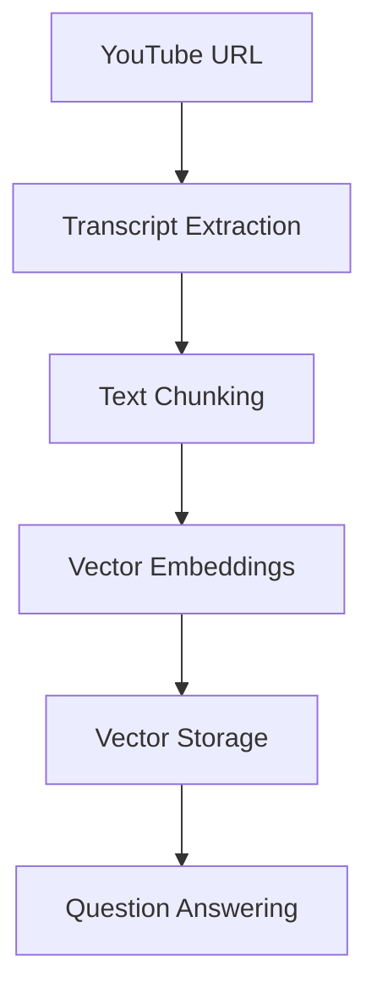

# YouTube RAG Assistant 🎥🔍

A Retrieval-Augmented Generation (RAG) application that answers questions about YouTube video content using AI.

## Workflow Overview

### 1. Video Processing Pipeline



---

## 🧩 2. Component Breakdown

### 📄 A. Transcript Extraction

- Utilizes **YouTube Transcript API**  
- Supports **multiple languages**  
- Handles edge cases like **disabled transcripts**

---

### ✂️ B. Text Chunking

```python
TextSplitter(
    chunk_size=512,
    chunk_overlap=100,
    separators=["\n\n", "\n", " ", ""]
)
```

- Splits transcript into context-aware chunks  
- Preserves continuity with **overlapping segments**  
- Adds metadata like `video_id`, `chunk_id`, etc.

---

### 🧠 C. Vector Embeddings

- Uses `BAAI/bge-small-en-v1.5` model  
- Embeddings are **normalized** for optimized retrieval  
- Supports **GPU acceleration**

---

### 🗃️ D. Vector Store

- Powered by **FAISS** with persistent disk storage  
- Creates **unique collections per video**  
- Automatically **cleans old data** before new input

---

### 🤖 E. Question Answering

- Retrieves **top 4 most relevant chunks**  
- Uses `google/flan-t5-large` for generation  
- Applies smart formatting:
  - Capitalizes the first letter  
  - Fixes punctuation  
  - Removes incomplete trailing sentences

---

## 🧑‍💻 3. User Interaction Flow

### 🔹 Input

- User enters a YouTube video URL via the **Streamlit interface**  
- System extracts and validates video ID

### 🔄 Processing

- Transcript fetched and processed  
- Chunks embedded into **FAISS vector DB**  
- **LLM initialized** and ready

### ❓ Question & Answer

- User asks questions in natural language  
- System returns:
  - Clean, formatted answer  
  - Option to **view source chunks**  
  - (Optional) Debug metadata

---

## ⚙️ 4. Configuration Parameters

| Parameter       | Default | Description                           |
|----------------|---------|---------------------------------------|
| `CHUNK_SIZE`   | 512     | Characters per chunk                  |
| `CHUNK_OVERLAP`| 100     | Characters of context overlap         |
| `TOP_K`        | 4       | Number of top chunks to retrieve      |
| `MAX_TOKENS`   | 300     | Max tokens for the generated answer   |
| `TEMPERATURE`  | 0.3     | Generation randomness (0 = deterministic) |

---

## 🚀 5. Technical Highlights

- **Hybrid RAG Architecture:** Efficient combination of retrieval + generation  
- **Fast Processing:** ~30s for a 10-minute video (varies by system)  
- **Quick Response:** ~300–500ms per question  
- **State Management:** Tracks progress, maintains conversation history, and resets on new input

---

## ✅ Tips for GitHub Rendering

- Ensure [Mermaid support](https://github.blog/2022-02-14-include-diagrams-markdown-files-mermaid/) is enabled  
- Use **consistent heading levels**  
- Prefer fenced code blocks (```) with language tags for highlighting  
- Keep your README focused and well-sectioned for clarity

---

## 🙌 Acknowledgements

- [LangChain](https://github.com/langchain-ai/langchain)  
- [HuggingFace Transformers](https://huggingface.co/transformers/)  
- [Streamlit](https://streamlit.io/)  
- [FAISS](https://github.com/facebookresearch/faiss)  
- [YouTube Transcript API](https://pypi.org/project/youtube-transcript-api/)
- [Vedio Refernce](https://www.youtube.com/watch?v=J5_-l7WIO_w&list=PLKnIA16_RmvaTbihpo4MtzVm4XOQa0ER0&index)

---

Made with 💡 by [Ravi Yadav](https://github.com/raviyadav44)  
Built using open-source LLMs, ChromaDB, and Streamlit
